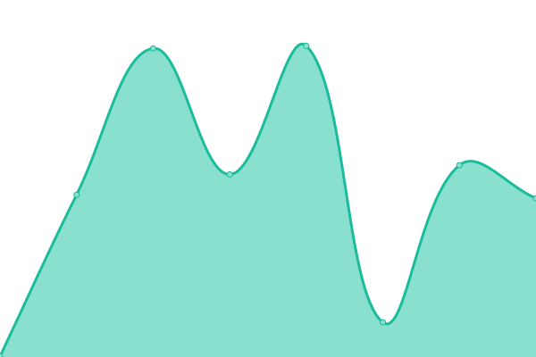
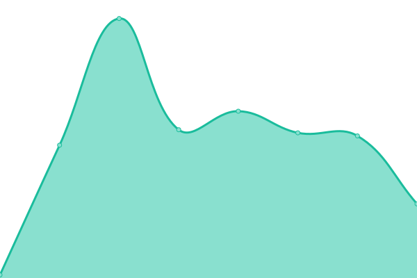
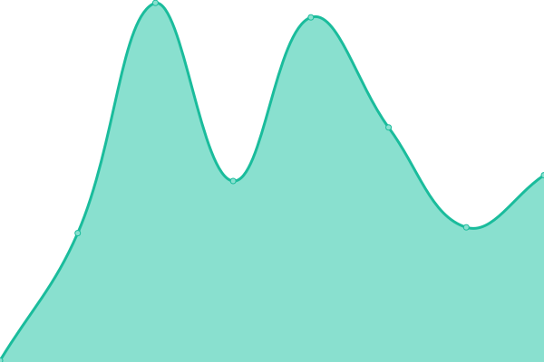

# [📈 Live Status](https://statuspage.is-a.fun): <!--live status--> **🟩 All systems operational**

This repository contains the open-source uptime monitor and status page for [L RMN](https://statuspage.is-a.fun), powered by [Upptime](https://github.com/upptime/upptime).

With [Upptime](https://upptime.js.org), you can get your own unlimited and free uptime monitor and status page, powered entirely by a GitHub repository. We use [Issues](https://github.com/lrmn7/statuspage/issues) as incident reports, [Actions](https://github.com/lrmn7/statuspage/actions) as uptime monitors, and [Pages](https://statuspage.is-a.fun) for the status page.

<!--start: status pages-->
<!-- This summary is generated by Upptime (https://github.com/upptime/upptime) -->
<!-- Do not edit this manually, your changes will be overwritten -->
<!-- prettier-ignore -->
| URL | Status | History | Response Time | Uptime |
| --- | ------ | ------- | ------------- | ------ |
|  [Lucy Website](https://lucy.is-a.fun/) | 🟩 Up | [lucy-website.yml](https://github.com/lrmn7/statuspage/commits/HEAD/history/lucy-website.yml) | 

 150ms
     
 | 

<a href="https://statuspage.is-a.fun/history/lucy-website">100.00%</a>
    

|  [Dashboard Lucy](https://dash-lucy.is-a.fun/) | 🟩 Up | [dashboard-lucy.yml](https://github.com/lrmn7/statuspage/commits/HEAD/history/dashboard-lucy.yml) | 

 963ms
     
 | 

<a href="https://statuspage.is-a.fun/history/dashboard-lucy">86.58%</a>
    

|  [Miu Website](https://miu.is-a.fun/) | 🟩 Up | [miu-website.yml](https://github.com/lrmn7/statuspage/commits/HEAD/history/miu-website.yml) | 

 842ms
     
 | 

<a href="https://statuspage.is-a.fun/history/miu-website">100.00%</a>
    

|  [+62 Radio Website](https://62radio.is-a.fun/) | 🟩 Up | [62-radio-website.yml](https://github.com/lrmn7/statuspage/commits/HEAD/history/62-radio-website.yml) | 

 180ms
     
 | 

<a href="https://statuspage.is-a.fun/history/62-radio-website">100.00%</a>
    

|  [Dailycat Website](https://dailycat.is-a.fun/) | 🟩 Up | [dailycat-website.yml](https://github.com/lrmn7/statuspage/commits/HEAD/history/dailycat-website.yml) | 

 133ms
     
 | 

<a href="https://statuspage.is-a.fun/history/dailycat-website">100.00%</a>
    

|  [Soothe Website](https://soothe.is-a.fun/) | 🟩 Up | [soothe-website.yml](https://github.com/lrmn7/statuspage/commits/HEAD/history/soothe-website.yml) | 

 95ms
     
 | 

<a href="https://statuspage.is-a.fun/history/soothe-website">100.00%</a>
    

|  [Oh!BOTLiST](https://ohbotlist.hop.sh/) | 🟩 Up | [oh-bot-li-st.yml](https://github.com/lrmn7/statuspage/commits/HEAD/history/oh-bot-li-st.yml) | 

 734ms
     
 | 

<a href="https://statuspage.is-a.fun/history/oh-bot-li-st">98.98%</a>
    

|  [L RMN Page](https://lrmn.is-a.dev/) | 🟩 Up | [l-rmn-page.yml](https://github.com/lrmn7/statuspage/commits/HEAD/history/l-rmn-page.yml) | 

 152ms
     
 | 

<a href="https://statuspage.is-a.fun/history/l-rmn-page">100.00%</a>
    

|  [L RMN Virtual Photography](https://lrmn-vp.site/) | 🟩 Up | [l-rmn-virtual-photography.yml](https://github.com/lrmn7/statuspage/commits/HEAD/history/l-rmn-virtual-photography.yml) | 

 165ms
     
 | 

<a href="https://statuspage.is-a.fun/history/l-rmn-virtual-photography">100.00%</a>
    

<!--end: status pages-->

[**Visit our status website →**](https://statuspage.is-a.fun)

## 📄 License

- Powered by: [Upptime](https://github.com/upptime/upptime)
- Code: [MIT](./LICENSE) © [L RMN](https://statuspage.is-a.fun)
- Data in the `./history` directory: [Open Database License](https://opendatacommons.org/licenses/odbl/1-0/)
