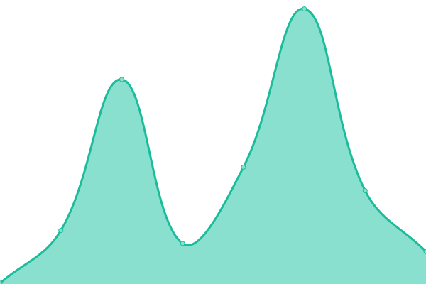
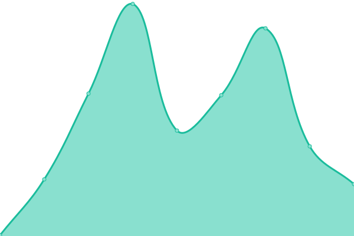
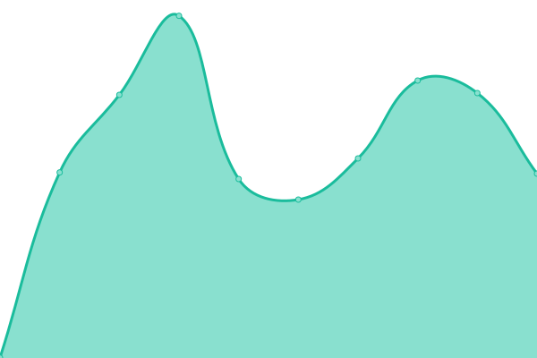
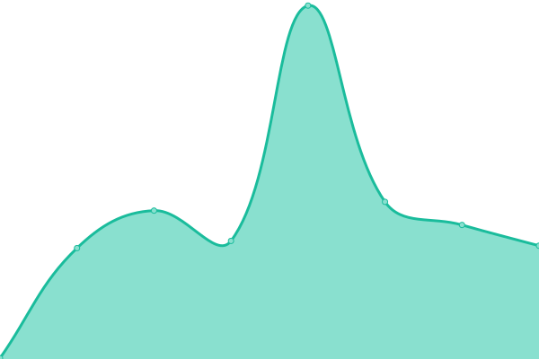
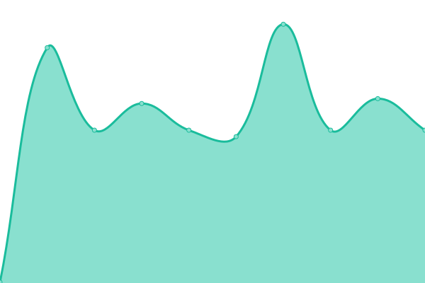

# [📈 Live Status](https://statuspage.is-a.fun): <!--live status--> **🟧 Partial outage**

This repository contains the open-source uptime monitor and status page for [L RMN](https://statuspage.is-a.fun), powered by [Upptime](https://github.com/upptime/upptime).

With [Upptime](https://upptime.js.org), you can get your own unlimited and free uptime monitor and status page, powered entirely by a GitHub repository. We use [Issues](https://github.com/lrmn7/statuspage/issues) as incident reports, [Actions](https://github.com/lrmn7/statuspage/actions) as uptime monitors, and [Pages](https://statuspage.is-a.fun) for the status page.

<!--start: status pages-->
<!-- This summary is generated by Upptime (https://github.com/upptime/upptime) -->
<!-- Do not edit this manually, your changes will be overwritten -->
<!-- prettier-ignore -->
| URL | Status | History | Response Time | Uptime |
| --- | ------ | ------- | ------------- | ------ |
|  [L RMN Page](https://lrmn.is-a.dev/) | 🟩 Up | [l-rmn-page.yml](https://github.com/lrmn7/statuspage/commits/HEAD/history/l-rmn-page.yml) | 

 141ms
     
 | 

<a href="https://statuspage.is-a.fun/history/l-rmn-page">100.00%</a>
    

|  [Personal Bio](https://is-a.fun/) | 🟩 Up | [personal-bio.yml](https://github.com/lrmn7/statuspage/commits/HEAD/history/personal-bio.yml) | 

 176ms
     
 | 

<a href="https://statuspage.is-a.fun/history/personal-bio">100.00%</a>
    

|  [Virtual Photography](https://lrmn-vp.site/) | 🟩 Up | [virtual-photography.yml](https://github.com/lrmn7/statuspage/commits/HEAD/history/virtual-photography.yml) | 

 216ms
     
 | 

<a href="https://statuspage.is-a.fun/history/virtual-photography">99.95%</a>
    

|  [OhBOTLiST](https://ohbot.is-a.fun/) | 🟩 Up | [oh-bot-li-st.yml](https://github.com/lrmn7/statuspage/commits/HEAD/history/oh-bot-li-st.yml) | 

 172ms
     
 | 

<a href="https://statuspage.is-a.fun/history/oh-bot-li-st">100.00%</a>
    

|  [Lucy Website](https://lucy.is-a.fun/) | 🟩 Up | [lucy-website.yml](https://github.com/lrmn7/statuspage/commits/HEAD/history/lucy-website.yml) | 

 158ms
     
 | 

<a href="https://statuspage.is-a.fun/history/lucy-website">100.00%</a>
    

|  [Dashboard Lucy](https://dash-lucy.is-a.fun/) | 🟩 Up | [dashboard-lucy.yml](https://github.com/lrmn7/statuspage/commits/HEAD/history/dashboard-lucy.yml) | 

 788ms
     
 | 

<a href="https://statuspage.is-a.fun/history/dashboard-lucy">100.00%</a>
    

|  [Mewwme's Website](https://meww.me/) | 🟥 Down | [mewwme-s-website.yml](https://github.com/lrmn7/statuspage/commits/HEAD/history/mewwme-s-website.yml) | 

 138ms
     
 | 

<a href="https://statuspage.is-a.fun/history/mewwme-s-website">0.00%</a>
    

|  [Mewwme's bot](http://168.119.88.145:3026) | 🟥 Down | [mewwme-s-bot.yml](https://github.com/lrmn7/statuspage/commits/HEAD/history/mewwme-s-bot.yml) | 

 0ms
     
 | 

<a href="https://statuspage.is-a.fun/history/mewwme-s-bot">0.00%</a>
    

|  [Miu🌛 Bot](http://168.119.88.145:3013) | 🟥 Down | [miu-bot.yml](https://github.com/lrmn7/statuspage/commits/HEAD/history/miu-bot.yml) | 

 0ms
     
 | 

<a href="https://statuspage.is-a.fun/history/miu-bot">0.00%</a>
    

|  [+62 Radio Bot](http://168.119.88.145:3014) | 🟥 Down | [62-radio-bot.yml](https://github.com/lrmn7/statuspage/commits/HEAD/history/62-radio-bot.yml) | 

 0ms
     
 | 

<a href="https://statuspage.is-a.fun/history/62-radio-bot">0.00%</a>
    

|  [Moo ♪ Bot](http://168.119.88.145:3022) | 🟥 Down | [moo-bot.yml](https://github.com/lrmn7/statuspage/commits/HEAD/history/moo-bot.yml) | 

 0ms
     
 | 

<a href="https://statuspage.is-a.fun/history/moo-bot">0.00%</a>
    

<!--end: status pages-->

[**Visit our status website →**](https://statuspage.is-a.fun)

## 📄 License

- Powered by: [Upptime](https://github.com/upptime/upptime)
- Code: [MIT](./LICENSE) © [L RMN](https://statuspage.is-a.fun)
- Data in the `./history` directory: [Open Database License](https://opendatacommons.org/licenses/odbl/1-0/)
