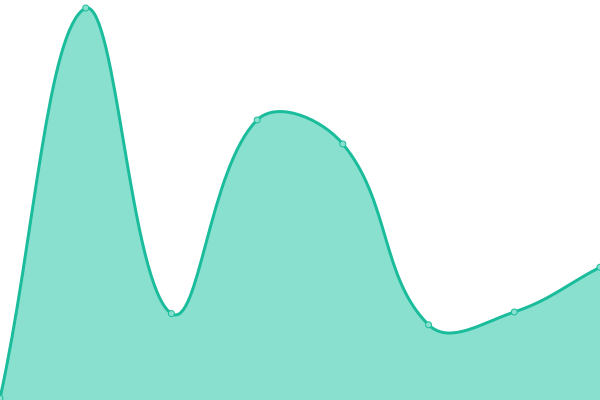
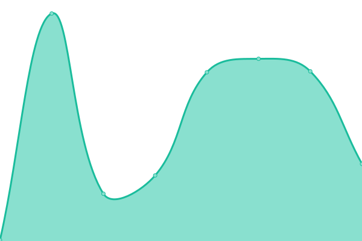
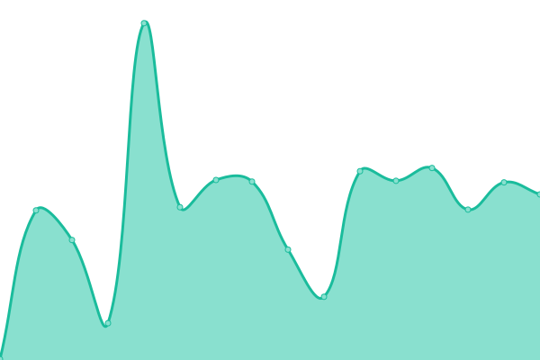

# [📈 Live Status](https://statuspage.is-a.fun): <!--live status--> **🟧 Partial outage**

This repository contains the open-source uptime monitor and status page for [L RMN](https://statuspage.is-a.fun), powered by [Upptime](https://github.com/upptime/upptime).

With [Upptime](https://upptime.js.org), you can get your own unlimited and free uptime monitor and status page, powered entirely by a GitHub repository. We use [Issues](https://github.com/lrmn7/statuspage/issues) as incident reports, [Actions](https://github.com/lrmn7/statuspage/actions) as uptime monitors, and [Pages](https://statuspage.is-a.fun) for the status page.

<!--start: status pages-->
<!-- This summary is generated by Upptime (https://github.com/upptime/upptime) -->
<!-- Do not edit this manually, your changes will be overwritten -->
<!-- prettier-ignore -->
| URL | Status | History | Response Time | Uptime |
| --- | ------ | ------- | ------------- | ------ |
|  [Website](https://meww.me/) | 🟥 Down | [website.yml](https://github.com/lrmn7/statuspage/commits/HEAD/history/website.yml) | 

 116ms
     
 | 

<a href="https://uptime.meww.me/history/website">100.00%</a>
    

|  [Docs](https://docs.meww.me/) | 🟥 Down | [docs.yml](https://github.com/lrmn7/statuspage/commits/HEAD/history/docs.yml) | 

 67ms
     
 | 

<a href="https://uptime.meww.me/history/docs">100.00%</a>
    

|  [Webserver](https://ws.meww.me/) | 🟩 Up | [webserver.yml](https://github.com/lrmn7/statuspage/commits/HEAD/history/webserver.yml) | 

 208ms
     
 | 

<a href="https://uptime.meww.me/history/webserver">94.73%</a>
    

<!--end: status pages-->

[**Visit our status website →**](https://statuspage.is-a.fun)

## 📄 License

- Powered by: [Upptime](https://github.com/upptime/upptime)
- Code: [MIT](./LICENSE) © [L RMN](https://statuspage.is-a.fun)
- Data in the `./history` directory: [Open Database License](https://opendatacommons.org/licenses/odbl/1-0/)
